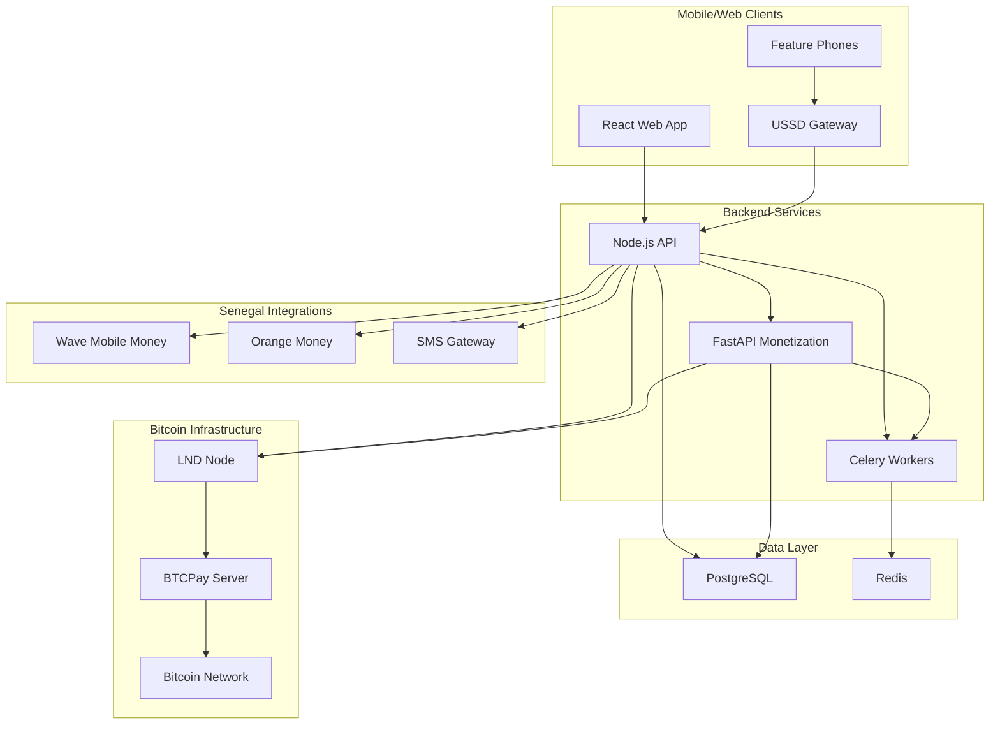
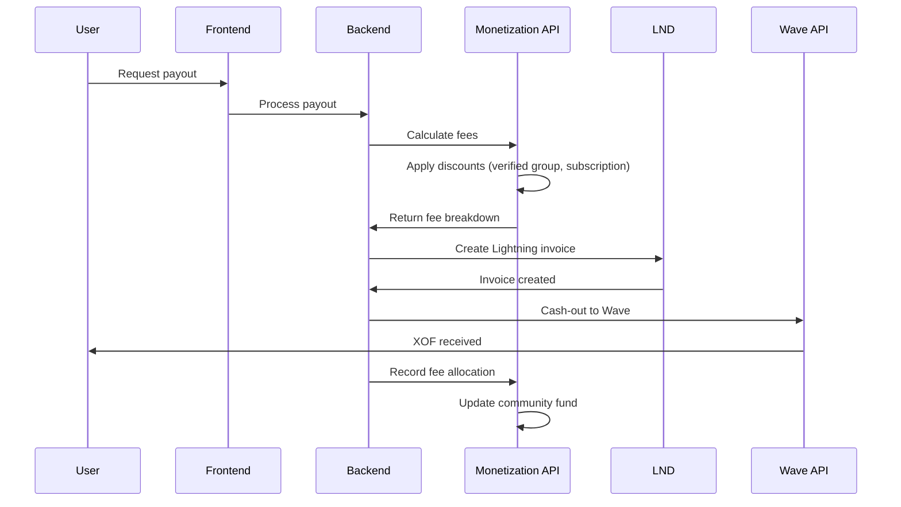

# SunuSàv — Our Savings, Our Future

**Bitcoin-powered digital tontines for Senegal**

[](https://opensource.org/licenses/MIT)
[](https://www.docker.com/)
[](https://lightning.network/)
[](https://en.wikipedia.org/wiki/Senegal)

> **Open-source, mobile-first platform that digitizes West African tontines using Bitcoin Lightning Network**

SunuSàv preserves communal savings rituals while reducing fraud and friction through Bitcoin's censorship-resistant, programmable money. Built specifically for Senegal's mobile money ecosystem with USSD fallback for feature phones.

## 🎯 Project Overview

SunuSàv is an open-source platform that digitizes the West African tontine (susu) model using Bitcoin and Lightning Network. Our goals:

- **Preserve communal savings rituals** while reducing fraud and friction
- **Make saving accessible** on low-end phones (USSD fallback, offline sync)
- **Use Lightning** for low-fee, fast payouts and optional on-chain settlement
- **Prioritize security, transparency, and community governance**

### Why SunuSàv?

- **Tontines are deeply social** and already widely used — digital tooling should augment, not replace
- **Lightning offers micro-sats economics** that make micro-savings practical
- **Senegal has strong mobile money penetration** and large remittance flows — ideal for Lightning on-ramps/off-ramps
- **Bitcoin's programmability** enables transparent, automated community fund management

## 📁 What's in This Repo

```
sunu-sav/
├── backend/                    # Node.js backend (API, services, workers)
│   ├── app.js                 # Main Express server
│   ├── routes/                # API endpoints
│   │   ├── tontine.js         # Core tontine logic
│   │   ├── senegal.js         # Senegal-specific features
│   │   └── webhook.js         # Lightning webhook handling
│   ├── services/              # Business logic
│   │   ├── TontineService.js  # Core tontine cycle management
│   │   ├── SenegalTontineService.js # Senegal-specific logic
│   │   ├── WaveMobileMoneyService.js # Wave integration
│   │   ├── USSDService.js     # USSD menu system
│   │   └── LightningService.js # LND integration
│   ├── monetization/          # Monetization system (FastAPI)
│   │   ├── models.py          # SQLAlchemy models
│   │   ├── services/          # Fee calculation, payouts
│   │   ├── api/               # FastAPI endpoints
│   │   └── tasks.py           # Celery background tasks
│   └── Dockerfile.backend
├── client/                    # React frontend (web)
│   ├── src/
│   │   ├── pages/             # Main application screens
│   │   ├── components/        # Reusable UI components
│   │   ├── i18n/              # French & Wolof translations
│   │   └── lib/               # Utilities & API client
│   └── Dockerfile.frontend
├── server/                    # tRPC server (existing)
├── drizzle/                   # Database schema & migrations
├── docs/                      # Architecture & API documentation
├── docker-compose.yml         # Full stack orchestration
└── start-demo.sh              # One-command demo setup
```

### Key Files to Inspect First

- `backend/services/TontineService.js` — Core tontine cycle logic
- `backend/services/SenegalTontineService.js` — Senegal-specific business logic
- `backend/services/WaveMobileMoneyService.js` — Wave mobile money integration
- `backend/monetization/services/payout.py` — Lightning payout orchestration
- `client/src/pages/Groups.tsx` — Main tontine management interface
- `client/src/components/SenegalSubscriptionManager.tsx` — Subscription management
- `client/src/i18n/` — French & Wolof translations

## 🚀 Quick Start

### Prerequisites

- **Docker & Docker Compose** (v2 recommended)
- **Node.js 18+** (for local dev tasks)
- **Python 3.11+** (for monetization system)
- **Optional**: LND testnet/regtest node (or use mock in docker-compose)

### One-Command Demo (Docker)

```bash
git clone https://github.com/lucylow/sunu-sav.git
cd sunu-sav

# Make start-demo.sh executable
chmod +x start-demo.sh

# Start everything (Postgres, Redis, backend, frontend, mock LND, monetization)
./start-demo.sh
```

The script:
- Builds all containers
- Runs DB migrations and seeds demo data
- Starts backend API and frontend dev server
- Starts monetization system (FastAPI + Celery)
- Starts mock Lightning/testnet node

### Manual Development Setup

#### Backend (Node.js)
```bash
cd backend
cp .env.example .env           # Edit for local environment
npm install
npm run migrate                # Run DB migrations
npm run seed                   # Optional demo seed
npm run dev                    # Start backend (nodemon)
```

#### Monetization System (Python/FastAPI)
```bash
cd backend/monetization
cp env.example .env            # Configure database & API keys
pip install -r requirements.txt
python -m uvicorn main:app --host 0.0.0.0 --port 8001
```

#### Frontend (React)
```bash
cd client
npm install
npm run dev                    # Vite dev server
```

### Health Checks & URLs

- **Backend API**: http://localhost:3000
- **Monetization API**: http://localhost:8001
- **API Documentation**: http://localhost:8001/docs
- **Frontend**: http://localhost:5173
- **Celery Flower**: http://localhost:5555

## 🏗️ Architecture

### High-Level Architecture



### Data Flow (User Contribution)

1. **User Contribution**: User scans QR/opens USSD → selects group → creates contribution intent
2. **Invoice Creation**: Frontend calls backend → backend generates Lightning invoice via LightningService
3. **Payment**: User pays using wallet (Alby/Zeus/phone) → LND sends webhook to backend
4. **Verification**: Webhook verified (HMAC) → contribution marked verified in DB
5. **Cycle Check**: `checkCycleCompletion` obtains advisory lock → enqueues payout job if cycle complete
6. **Payout**: Worker processes payout → calls LND REST to pay winner → updates DB → emits notifications

### Monetization Flow



## ⚖️ Key Design Constraints & Tradeoffs

### Non-custodial vs Hybrid
- **MVP**: Hybrid multisig pattern (2/3) to balance usability & protection
- **Long-term**: Favors non-custodial with user-controlled keys

### Testnet First
- Always develop and demo on testnet/regtest to avoid real-money risk
- Production deployment requires explicit testnet → mainnet migration

### Offline-First UX
- Local DB (SQLite/AsyncStorage) is single source of truth on device
- Server is authoritative when online
- Queue writes for offline contributions

### Low-Bandwidth Payloads
- Keep JSON responses under ~5KB for key screens
- Use caching & delta sync
- Optimize for 2G/3G networks

### Security vs UX
- HMAC webhooks, least privilege macaroons
- Easy onboarding (phone + USSD)
- Balance security with accessibility

## 🔒 Security by Design

### High-Impact Patterns

#### Webhook Verification (Raw Body HMAC)
```javascript
// Setup raw body capture
app.use(bodyParser.json({ 
  verify: (req, res, buf) => { req.rawBody = buf }
}));

// Verify webhook signature
const sig = req.get('x-sunu-signature'); // hex
const secret = process.env.WEBHOOK_HMAC_SECRET;
const computed = crypto.createHmac('sha256', secret)
  .update(req.rawBody).digest('hex');

if (!crypto.timingSafeEqual(
  Buffer.from(sig, 'hex'), 
  Buffer.from(computed, 'hex')
)) {
  return res.status(401).send('Invalid signature');
}
```

#### Least-Privilege LND Macaroons
```javascript
// Use restricted macaroon (payment-only, not admin)
const macaroon = fs.readFileSync(process.env.LND_MACAROON_PATH);
const headers = {
  'Grpc-Metadata-macaroon': macaroon.toString('hex')
};
```

#### Advisory Locks for Cycle Payouts
```sql
-- Prevent race conditions in payout processing
SELECT pg_advisory_xact_lock(hashtext($1));
-- Process payout...
-- Lock automatically released on transaction end
```

#### Durable Background Jobs
```python
# Celery task with retry logic
@celery.task(bind=True, max_retries=3)
def process_payout(self, cycle_id):
    try:
        # Process payout logic
        pass
    except Exception as e:
        if self.request.retries < self.max_retries:
            raise self.retry(countdown=60 * (2 ** self.request.retries))
        raise
```

### Security Checklist

- ✅ **PII Scrubbing**: Redact phone numbers, invoices in logs
- ✅ **Rate Limiting**: API keys for critical endpoints
- ✅ **Idempotency**: Unique indexes on payment_attempts table
- ✅ **TLS Verification**: LND client verifies TLS certificates
- ✅ **Input Validation**: Sanitize all user inputs
- ✅ **Audit Logging**: Complete transaction audit trail

## 📱 Offline-First & Local Context Features

### Local Single Source of Truth
```javascript
// SQLite schema for offline storage
const schema = `
  CREATE TABLE groups (
    id TEXT PRIMARY KEY,
    name TEXT NOT NULL,
    contribution_amount INTEGER,
    max_members INTEGER,
    current_cycle INTEGER,
    last_synced_at DATETIME
  );
`;
```

### Sync Runner
```javascript
// Background sync with exponential backoff
class SyncRunner {
  async syncPendingContributions() {
    const pending = await this.getPendingContributions();
    for (const contribution of pending) {
      try {
        await this.uploadContribution(contribution);
        await this.markSynced(contribution.id);
      } catch (error) {
        await this.scheduleRetry(contribution.id);
      }
    }
  }
}
```

### USSD Fallback
```
SunuSàv Tontine Bitcoin
1. Cotisation actuelle
2. Mon solde
3. Historique
4. Prochain paiement
5. Aide
0. Quitter
```

## 🔌 Integrations

### Lightning Network (LND REST)

**Production Pattern:**
```javascript
class LndClient {
  async createInvoice(memo, amountSats) {
    const response = await this.client.post('/v1/invoices', {
      memo,
      value: amountSats,
      expiry: 3600
    });
    return response.data;
  }
  
  async sendPayment(paymentRequest) {
    const response = await this.client.post('/v2/router/send', {
      payment_request: paymentRequest,
      timeout_seconds: 60
    });
    return response.data;
  }
}
```

**Security:**
- Use restricted macaroon (payment-only)
- TLS certificate verification
- Watchtower integration for channel security

### Wave Mobile Money Integration

```javascript
class WaveMobileMoneyService {
  async cashOutToWave(phoneNumber, amountXof, reference) {
    const requestBody = {
      recipient_phone_number: this.formatSenegalPhoneNumber(phoneNumber),
      amount: amountXof,
      currency: 'XOF',
      reference: reference
    };
    
    const signature = this.generateSignature(requestBody);
    const response = await axios.post(endpoint, requestBody, {
      headers: {
        'Authorization': `Bearer ${this.apiKey}`,
        'X-Wave-Signature': signature
      }
    });
    
    return response.data;
  }
}
```

### BTCPayServer Integration

```javascript
// Use BTCPay as payment gateway
const btcpay = new BTCPayClient({
  host: process.env.BTCPAY_HOST,
  apiKey: process.env.BTCPAY_API_KEY
});

const invoice = await btcpay.createInvoice({
  amount: amountSats,
  currency: 'BTC',
  description: 'SunuSàv Tontine Contribution'
});
```

### Nostr Integration

```javascript
// Publish contribution proofs to Nostr
const nostrEvent = {
  kind: 30023, // Long-form content
  content: `SunuSàv contribution proof\nHash: ${contributionHash}`,
  tags: [
    ['d', 'sunusav-contribution'],
    ['hash', contributionHash]
  ]
};

await this.publishToNostr(nostrEvent);
```

## 📊 Operational & Observability

### Minimum Monitoring Stack

- **Prometheus** + **Grafana** dashboards
- **Error tracking** (Sentry)
- **Structured JSON logs** → Logstash/ELK
- **Alerts**: PagerDuty/Slack/Email

### Essential Metrics

```javascript
// Prometheus metrics
const promClient = require('prom-client');

const httpRequestDuration = new promClient.Histogram({
  name: 'http_request_duration_seconds',
  help: 'Duration of HTTP requests in seconds',
  labelNames: ['method', 'route', 'status_code']
});

const lndPaymentSuccess = new promClient.Counter({
  name: 'lnd_payment_success_total',
  help: 'Total successful Lightning payments'
});

const cycleCompletionRate = new promClient.Gauge({
  name: 'tontine_cycle_completion_rate',
  help: 'Percentage of cycles completed successfully'
});
```

### Health Endpoints

```javascript
// /health endpoint
app.get('/health', async (req, res) => {
  const health = {
    status: 'healthy',
    timestamp: new Date().toISOString(),
    services: {
      database: await checkDatabase(),
      redis: await checkRedis(),
      lnd: await checkLnd(),
      monetization: await checkMonetizationAPI()
    }
  };
  
  const isHealthy = Object.values(health.services)
    .every(service => service.status === 'healthy');
  
  res.status(isHealthy ? 200 : 503).json(health);
});
```

## 📈 Metrics & KPIs

### Product/Business Metrics

```sql
-- Daily Active Users
SELECT COUNT(DISTINCT user_id) 
FROM contributions 
WHERE created_at >= CURRENT_DATE;

-- Cycle Completion Rate
SELECT 
  COUNT(CASE WHEN status = 'completed' THEN 1 END) * 100.0 / COUNT(*) 
FROM tontine_cycles 
WHERE created_at >= CURRENT_DATE - INTERVAL '30 days';

-- Average Group Size
SELECT AVG(current_members) 
FROM groups 
WHERE status = 'active';
```

### System/Technical Metrics

- **API Response Time**: p95, p99 latency
- **Pending Payouts Queue**: BullMQ queue length
- **LND Success Rate**: Payment success/failure ratio
- **Worker Retry Rate**: Failed job retry percentage
- **DB Error Rate**: Database connection failures
- **Uptime**: Service availability percentage

### Senegal-Specific Metrics

```python
# Wave cash-out success rate
wave_success_rate = successful_wave_payouts / total_wave_payouts

# USSD session completion rate
ussd_completion_rate = completed_ussd_sessions / total_ussd_sessions

# Language preference distribution
language_distribution = {
    'fr': french_users / total_users,
    'wo': wolof_users / total_users,
    'en': english_users / total_users
}
```

## 🚢 Next Iteration — What We'll Ship

### Short Term (0–6 weeks) — Pilot in Dakar

**Core Features:**
- ✅ **Real LND testnet integration** (replace mock)
- ✅ **Worker queue for payouts** (BullMQ + Celery)
- ✅ **Robust webhook verification** (HMAC raw-body)
- ✅ **Offline queue & sync runner** in mobile app
- ✅ **USSD gateway stub** for feature phones
- ✅ **Wolof + French UX** for all core flows
- ✅ **Basic analytics** (Prometheus + Grafana)

**Senegal-Specific:**
- ✅ **Wave mobile money integration** (API + cash-out)
- ✅ **Holiday-aware scheduling** (Korité, Tabaski, etc.)
- ✅ **Subscription tiers** (Pro: 500 XOF/month)
- ✅ **Community fund transparency** (20% fee allocation)

### Medium Term (6–16 weeks)

**Pilot Expansion:**
- **10–20 groups in Dakar** (100–200 users)
- **Real pilot metrics collection**
- **User feedback integration**

**Technical Enhancements:**
- **Fedimint/Cashu experiments** for semi-custodial liquidity
- **AI credit scoring prototype** + micro-rewards
- **Fraud detection pipeline** (anomaly scoring)
- **Orange Money integration** (second mobile money provider)

### Long Term (3–9 months)

**Advanced Features:**
- **Multi-node Lightning topology** and regional liquidity pools
- **Governance & SAV token pilot** (experimental)
- **Full KYC/AML compliance** workflow
- **Production security audit** and penetration testing

## 🧪 Development Workflow

### Local Testing

```bash
# Run all tests
npm test                    # Backend + frontend unit tests
npm run test:integration    # Integration tests
npm run test:e2e           # End-to-end tests

# Test specific components
npm run test:backend        # Backend tests only
npm run test:frontend       # Frontend tests only
npm run test:monetization   # Monetization system tests
```

### CI/CD Pipeline

```yaml
# .github/workflows/ci.yml
name: CI
on: [push, pull_request]
jobs:
  test:
    runs-on: ubuntu-latest
    steps:
      - uses: actions/checkout@v3
      - name: Setup Node.js
        uses: actions/setup-node@v3
        with:
          node-version: '18'
      - name: Install dependencies
        run: npm ci
      - name: Run tests
        run: npm test
      - name: Build containers
        run: docker-compose build
```

### Code Style

- **ESLint + Prettier** enforced in pre-commit hooks
- **Conventional commits** & semantic release pipeline
- **TypeScript** for type safety (gradual migration)

## 🤝 Contributing & Governance

### Development Process

1. **Fork** the repository
2. **Create feature branch**: `feature/short-description`
3. **Make changes** with tests
4. **Open PR** with clear description
5. **Get review** from maintainers
6. **Merge** after CI passes

### Major Design Changes

- **RFC required** in `/docs/rfcs/`
- **Maintainer review** + community input
- **Core protocol changes** (payout logic, multisig rules) require consensus

### Community Governance

- **Maintainers**: Repository owners (see CODEOWNERS)
- **Community Captains**: Pilot group leaders in Dakar
- **Decisions**: Maintainers + community captains during pilot phase

## 📄 License & Acknowledgements

**License**: MIT (see [LICENSE](LICENSE) file)

**Acknowledgements**:
- Bitcoin Senegal community
- Lightning Network developers
- Pilot community partners in Dakar
- Wave Mobile Money team
- Open-source contributors

## 🗺️ Where to Start Reading Code

### For Backend Developers

1. **`backend/services/TontineService.js`** — Core tontine business logic
2. **`backend/services/SenegalTontineService.js`** — Senegal-specific extensions
3. **`backend/routes/webhook.js`** — Lightning webhook handling
4. **`backend/monetization/services/payout.py`** — Payout orchestration
5. **`backend/services/WaveMobileMoneyService.js`** — Wave integration

### For Frontend Developers

1. **`client/src/pages/Groups.tsx`** — Main tontine management interface
2. **`client/src/components/SenegalSubscriptionManager.tsx`** — Subscription management
3. **`client/src/i18n/`** — French & Wolof translations
4. **`client/src/components/WaveCashOutModal.tsx`** — Wave cash-out flow

### For DevOps/Infrastructure

1. **`docker-compose.yml`** — Full stack orchestration
2. **`backend/monetization/docker-compose.yml`** — Monetization services
3. **`start-demo.sh`** — Demo setup script
4. **`backend/monetization/requirements.txt`** — Python dependencies

## ✅ Pilot Checklist

### Pre-Pilot Setup

- [ ] **Provision LND testnet** with channels + liquidity
- [ ] **Securely store macaroons & TLS certs** (never commit)
- [ ] **Configure WEBHOOK_HMAC_SECRET** and distribute to LND
- [ ] **Run migrations and seed data**
- [ ] **Verify all health endpoints**

### Pilot Execution

- [ ] **Onboard 3–10 tontine groups** (30–100 users)
- [ ] **Measure cycle_completion_rate** (target: >90%)
- [ ] **Track payout_success_rate** (target: >95%)
- [ ] **Monitor Wave cash-out success** (target: >95%)
- [ ] **Collect user feedback** on USSD & low-bandwidth UX

### Post-Pilot

- [ ] **Analyze pilot metrics** and user feedback
- [ ] **Iterate UX** based on real usage patterns
- [ ] **Plan mainnet migration** strategy
- [ ] **Scale to additional regions** (Mali, Burkina Faso)

---

## 🎯 Mission Statement

> **SunuSàv preserves the social fabric of West African tontines while leveraging Bitcoin's programmability to create transparent, efficient, and accessible communal savings tools.**

**Built with ❤️ for Senegal, powered by ⚡ Lightning Network**

---

*For questions, issues, or contributions, please open an issue or start a discussion in the repository.*